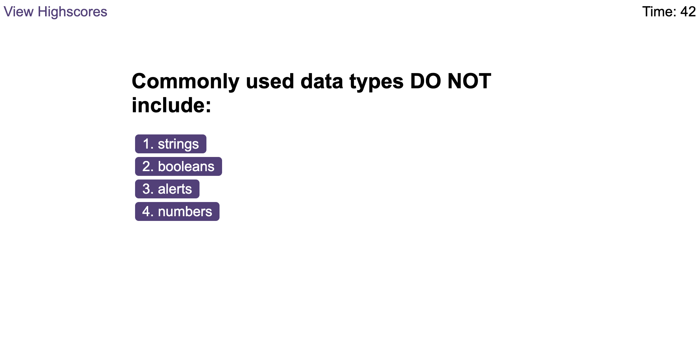

# Timed Quiz App

This project iterates over a 2D array of monthly profits to calculate:

- Total Months
- Total Profit
- Average Change
- Greatest Increase in Profits/Losses
- Greatest Decrease in Profits/Losses

# Install

1. NPM Install
2. Open a console, go to project directory and type node .

# Output

The console output should look like this:

# Hosted

You can see a live version at https://philmanwithbeard.github.io/Console-Finances/
